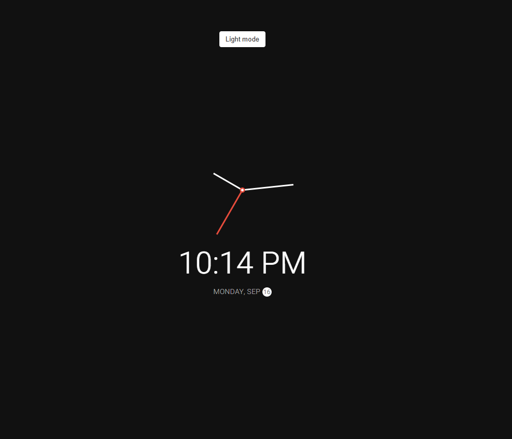
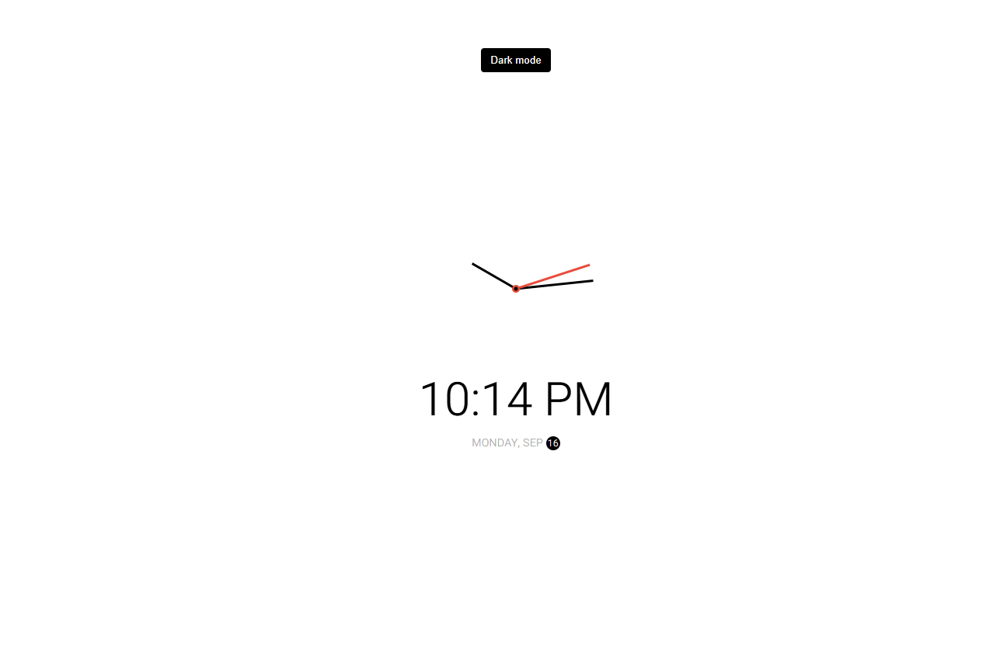

<!-- Title and Description -->
<h1 align="center">
  Theme Clock
   
</h1>

  A simple theme-based clock with dark and light mode built using HTML, JavaScript, and CSS.

<!-- Screenshots -->
<h2 align="center">Screenshots</h2>

  
  

<!-- Description and Features -->
<h2 align="center">Description</h2>

  A theme-based clock that switches between dark and light modes. The clock displays the current time, and the user can toggle between themes for a visually pleasing experience in both day and night settings.

<h2 align="center">Features</h2>

  <ul>
    <li>🕰️ Displays the current time in a clean, minimalist design</li>
    <li>🌗 Toggle between dark and light themes</li>
    <li>✨ Responsive and user-friendly interface</li>
  </ul>

<!-- Technologies Used -->
<h2 align="center">Technologies Used</h2>

  HTML, JavaScript, CSS

<!-- Installation Instructions -->
<h2 align="center">Installation</h2>

  To run the app locally, follow these steps:

  <ol>
    <li>Clone the repository:
      <pre><code>https://github.com/yacinova/theme-clock.git</code></pre>
    </li>
    <li>Navigate to the project directory:
      <pre><code>cd theme-clock</code></pre>
    </li>
   <li>Start the app:  
  Open <code>index.html</code> in your browser.</li>
  </ol>

---

Made with ❤️ by YASSINE HAMDOUNE

  Contact: <a href="mailto:hamdouneyassine.03@gmail.com">hamdouneyassine.03@gmail.com</a>

